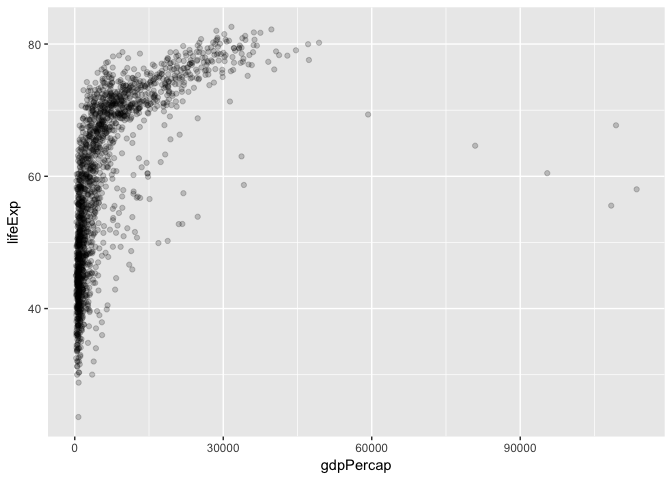

Hw02
================
Xinyao Fan
2017-09-22

``` r
library(tidyverse)
```

    ## Loading tidyverse: ggplot2
    ## Loading tidyverse: tibble
    ## Loading tidyverse: tidyr
    ## Loading tidyverse: readr
    ## Loading tidyverse: purrr
    ## Loading tidyverse: dplyr

    ## Conflicts with tidy packages ----------------------------------------------

    ## filter(): dplyr, stats
    ## lag():    dplyr, stats

``` r
library(gapminder)
```

Smell test the data
-------------------

**Q1**: Is it a data.frame, a matrix, a vector, a list?

``` r
typeof(gapminder)
```

    ## [1] "list"

It is a list.<br>
**Q2**: What's its class?

``` r
class(gapminder)
```

    ## [1] "tbl_df"     "tbl"        "data.frame"

There are three classes in "gapminder": tbl\_df, tbl and data.frame.<br>
**Q3**: How many variables/columns?

``` r
ncol(gapminder)
```

    ## [1] 6

There are 6 variables in gapminder.<br>
**Q4**: How many rows/observations?

``` r
nrow(gapminder)
```

    ## [1] 1704

There are 1704 observations.<br>
**Q5**: Can you get these facts about “extent” or “size” in more than one way? Can you imagine different functions being useful in different contexts?

``` r
dim(gapminder)
```

    ## [1] 1704    6

``` r
str(gapminder)
```

    ## Classes 'tbl_df', 'tbl' and 'data.frame':    1704 obs. of  6 variables:
    ##  $ country  : Factor w/ 142 levels "Afghanistan",..: 1 1 1 1 1 1 1 1 1 1 ...
    ##  $ continent: Factor w/ 5 levels "Africa","Americas",..: 3 3 3 3 3 3 3 3 3 3 ...
    ##  $ year     : int  1952 1957 1962 1967 1972 1977 1982 1987 1992 1997 ...
    ##  $ lifeExp  : num  28.8 30.3 32 34 36.1 ...
    ##  $ pop      : int  8425333 9240934 10267083 11537966 13079460 14880372 12881816 13867957 16317921 22227415 ...
    ##  $ gdpPercap: num  779 821 853 836 740 ...

You can get these facts also using **dim( )**or **str( )**, using 'dim', you can get both columns and rows of the dataset. For'str()', it can give the following information of dataset: the dimension of the dataset, class, variables, the type of variables and the levels(values) of the variables. So, it can provide a detailed overview of the dataset.<br>
**Q6**: What data type is each variable? As the results showed by 'str(gapminder)',
country: Factor
continent: Factor
year: int
LifeExp: num
pop: int
gdpPercap: num

Explore individual variables
----------------------------

I will choose categorical variable: continent and quantitative variable: gdpPercap.<br>
**Q1**: what are possbile values(or range, whichever is appropriate) of each variable?

``` r
summary(gapminder$continent)
```

    ##   Africa Americas     Asia   Europe  Oceania 
    ##      624      300      396      360       24

There are 5 levels of variable'continent': Africa, Americas, Asia, Europe and Oceania.

``` r
summary(gapminder$gdpPercap)
```

    ##     Min.  1st Qu.   Median     Mean  3rd Qu.     Max. 
    ##    241.2   1202.1   3531.8   7215.3   9325.5 113523.1

GdpPercap ranges from 241.2 to 113523.1. The mean, median of the dataset is 7215.3, 3531.8 and half of the data is in the range(1202.1, 9325.5)<br>
**Q2**: What values are typical? What’s the spread? What’s the distribution?

``` r
table(gapminder$continent)
```

    ## 
    ##   Africa Americas     Asia   Europe  Oceania 
    ##      624      300      396      360       24

From this table, most of the data comes from Africa while few data comes from Oceania. Actually, we can get the exact value of the number of data for each continent from the table.
As for the gdpPercap variable(quantative variable), we'd better use histogram to find its distribution.

``` r
hist(gapminder$gdpPercap)
```


From this picture, we can clearly see its distribution skewed to the right. Most of the data fall in the interval(0,20000).

Explore various plot types
--------------------------

-   A scatterplot of two quantitative variables.
-   A plot of one quantitative variable. Maybe a histogram or densityplot or frequency polygon.
-   A plot of one quantitative variable and one categorical. Maybe boxplots for several continents or countries.

### scatterplot of gdpPercap vs lifeExp

``` r
p<-ggplot(gapminder, aes(x = gdpPercap, y = lifeExp)) 
p+geom_point(alpha=0.2)
```



log transform

``` r
p<- p+ geom_point(alpha=0.2)+ scale_x_log10()
```

MAP continent variable to aesthetic color

``` r
p + geom_point(aes(color = continent))
```


Since data of 'Africa' is typical, we will explore the subset of the data and only consider the data in 'Africa' continent.

``` r
subset<-gapminder %>%
  filter(continent %in% "Africa") %>%
  select(country, year, lifeExp, gdpPercap)
```

``` r
ggplot(subset, aes(x = gdpPercap, y = lifeExp, color = year))+ geom_point(alpha=0.2)+scale_x_log10()+geom_smooth()
```

    ## `geom_smooth()` using method = 'loess'


### A plot of one quantitative variable: lifeExp

**Plot1:histogram**

``` r
p1<-ggplot(gapminder,aes(x = lifeExp, fill = continent))
p1+geom_histogram(position = "identity")
```

    ## `stat_bin()` using `bins = 30`. Pick better value with `binwidth`.


**Plot2:frenquency polygon for continents execpt Oceania**

``` r
ggplot(subset(gapminder,continent!="Oceania"), aes(x = lifeExp, color = continent)) +geom_freqpoly()
```

    ## `stat_bin()` using `bins = 30`. Pick better value with `binwidth`.


**Plot3:density plot for Africa and Europe**

``` r
ggplot(subset(gapminder, continent %in% c("Africa","Europe")),
       aes(x = lifeExp, fill = continent)) + geom_density(alpha = 0.2)
```


### A plot of one quantitative variable and one categorical

``` r
p3 <- ggplot(gapminder,aes(x=continent,y=lifeExp))
p3 + geom_boxplot(color="light pink")
```


Now, we explore a subset of data. We want to compare the life expectation of coutries in Aisa whose mean GDP is over 1000 billion.

``` r
out1<-gapminder%>%
  group_by(country)%>%
  mutate(gdp=gdpPercap * pop, gdpBill=round(gdp/1000000000, 1),mean_gdp=mean(gdpBill))%>%
  filter(continent == "Asia", mean_gdp > 1000)
ggplot(out1, aes(x=country,y=lifeExp)) + geom_boxplot()
```


So,only China and Japan have mean GDP&gt;1000 in Asia, and obviously, the life expectation of Japan is longer then it of China.

### Use filter(), selcet() and %&gt;%

Actually, we have used filter(), select() and piping above, but we want to pratice more. If we want to compare the gdpperCap of several coutries: China, Japan, Canada, and Mexico.

``` r
subset=filter(gapminder,country %in% c("Canada", "China", "Japan", "Mexico"))
ggplot(subset, aes(x = year, y = lifeExp, color = country)) + geom_line() + geom_point()
```


Now, we can try to use piping.

``` r
gapminder %>%
  filter(country %in% c("Canada", "China", "Japan", "Mexico"))%>%
  ggplot(aes(x = year, y = lifeExp, color = country)) + geom_line() + geom_point()
```

 

##More things

Evaluate this code and describe the result.

``` r
knitr::kable(filter(gapminder, country == c("Rwanda", "Afghanistan")))
```

| country     | continent |  year|  lifeExp|       pop|  gdpPercap|
|:------------|:----------|-----:|--------:|---------:|----------:|
| Afghanistan | Asia      |  1957|   30.332|   9240934|   820.8530|
| Afghanistan | Asia      |  1967|   34.020|  11537966|   836.1971|
| Afghanistan | Asia      |  1977|   38.438|  14880372|   786.1134|
| Afghanistan | Asia      |  1987|   40.822|  13867957|   852.3959|
| Afghanistan | Asia      |  1997|   41.763|  22227415|   635.3414|
| Afghanistan | Asia      |  2007|   43.828|  31889923|   974.5803|
| Rwanda      | Africa    |  1952|   40.000|   2534927|   493.3239|
| Rwanda      | Africa    |  1962|   43.000|   3051242|   597.4731|
| Rwanda      | Africa    |  1972|   44.600|   3992121|   590.5807|
| Rwanda      | Africa    |  1982|   46.218|   5507565|   881.5706|
| Rwanda      | Africa    |  1992|   23.599|   7290203|   737.0686|
| Rwanda      | Africa    |  2002|   43.413|   7852401|   785.6538|

The result is not correct, becasue they omit several lines. When we use logic symbol "==",the first country will compare with "Rwanda", the second one will compare with"Afghanistan", the third one will compare with "Rwanda", the fourth will compare with"Afghanistan" and so on. So, it lost half of the data. The correct one is the following:

``` r
knitr::kable(filter(gapminder, country%in%c("Rwanda","Afghanistan")))
```

| country     | continent |  year|  lifeExp|       pop|  gdpPercap|
|:------------|:----------|-----:|--------:|---------:|----------:|
| Afghanistan | Asia      |  1952|   28.801|   8425333|   779.4453|
| Afghanistan | Asia      |  1957|   30.332|   9240934|   820.8530|
| Afghanistan | Asia      |  1962|   31.997|  10267083|   853.1007|
| Afghanistan | Asia      |  1967|   34.020|  11537966|   836.1971|
| Afghanistan | Asia      |  1972|   36.088|  13079460|   739.9811|
| Afghanistan | Asia      |  1977|   38.438|  14880372|   786.1134|
| Afghanistan | Asia      |  1982|   39.854|  12881816|   978.0114|
| Afghanistan | Asia      |  1987|   40.822|  13867957|   852.3959|
| Afghanistan | Asia      |  1992|   41.674|  16317921|   649.3414|
| Afghanistan | Asia      |  1997|   41.763|  22227415|   635.3414|
| Afghanistan | Asia      |  2002|   42.129|  25268405|   726.7341|
| Afghanistan | Asia      |  2007|   43.828|  31889923|   974.5803|
| Rwanda      | Africa    |  1952|   40.000|   2534927|   493.3239|
| Rwanda      | Africa    |  1957|   41.500|   2822082|   540.2894|
| Rwanda      | Africa    |  1962|   43.000|   3051242|   597.4731|
| Rwanda      | Africa    |  1967|   44.100|   3451079|   510.9637|
| Rwanda      | Africa    |  1972|   44.600|   3992121|   590.5807|
| Rwanda      | Africa    |  1977|   45.000|   4657072|   670.0806|
| Rwanda      | Africa    |  1982|   46.218|   5507565|   881.5706|
| Rwanda      | Africa    |  1987|   44.020|   6349365|   847.9912|
| Rwanda      | Africa    |  1992|   23.599|   7290203|   737.0686|
| Rwanda      | Africa    |  1997|   36.087|   7212583|   589.9445|
| Rwanda      | Africa    |  2002|   43.413|   7852401|   785.6538|
| Rwanda      | Africa    |  2007|   46.242|   8860588|   863.0885|

Report
------

For this homework, it is easy to use a single syntax, such as get the subset of data, plot a historgram or boxplot(even we have not studied at class).<br>

However, when I combined these syntax together to analyze a complex problem, things become difficult. For instance, I want to select the countries whose mean GDP is over 1000 billion in Asia, and then compare the life expectation of these countries. It took me a long time coding to work out, because I need to use piping, filter, mutate, group\_by and ggplot to slove this problem. First, I used summarise(m) to get the mean GDP of each country. However, if I use 'summarise(mean\_gdp=mean(gdpBill))', I will just get the data about country and their mean\_gdp and lost the information about their life expectation and continent, so I can not get a boxplot.<br>

I found a helpful [tutorial](https://github.com/jennybc/ggplot2-tutorial/blob/master/README.md) and I learned how to draw scatterplot, histogram, boxplot, and other plots from this website.
