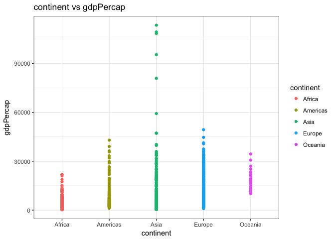
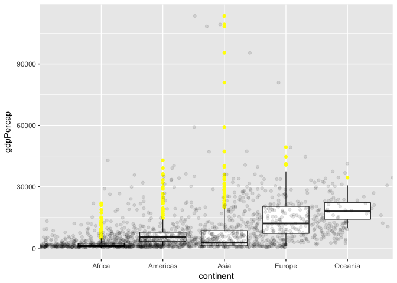
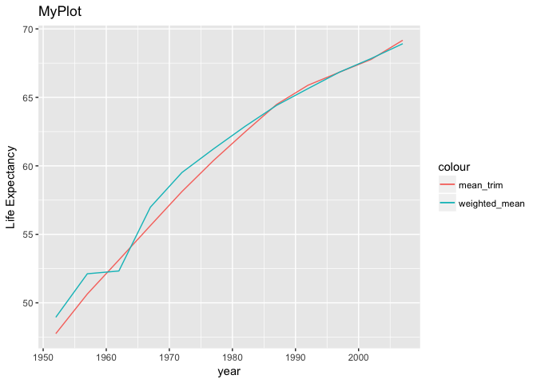
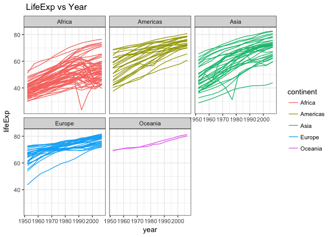

Hw03
================
Xinyao Fan
2017-09-28

``` r
library(gapminder)
library(tidyverse)
```

    ## Loading tidyverse: ggplot2
    ## Loading tidyverse: tibble
    ## Loading tidyverse: tidyr
    ## Loading tidyverse: readr
    ## Loading tidyverse: purrr
    ## Loading tidyverse: dplyr

    ## Conflicts with tidy packages ----------------------------------------------

    ## filter(): dplyr, stats
    ## lag():    dplyr, stats

Task Menu
---------

**Q1** Get the maximum and minimum of GDP per capita for all continents.

``` r
out<-gapminder%>%
  group_by(continent)%>%
  summarise(max_gdpPercap=max(gdpPercap), min_gdpPercap=min(gdpPercap))
knitr::kable(out)
```

| continent |  max\_gdpPercap|  min\_gdpPercap|
|:----------|---------------:|---------------:|
| Africa    |        21951.21|        241.1659|
| Americas  |        42951.65|       1201.6372|
| Asia      |       113523.13|        331.0000|
| Europe    |        49357.19|        973.5332|
| Oceania   |        34435.37|      10039.5956|

Combined the above table and this plot, we could see the maximum and minimum of gdpPercap for each continent more clearly.

``` r
ggplot(gapminder,aes(x=continent,y=gdpPercap))+geom_point(aes(color=continent))+theme_bw()+labs(title="continent vs gdpPercap")
```



Actually, we can know which continent and when gets the largest gdpPercap using the following code:

``` r
gapminder$continent[gapminder$gdpPercap==max(gapminder$gdpPercap)]
```

    ## [1] Asia
    ## Levels: Africa Americas Asia Europe Oceania

``` r
gapminder$year[gapminder$gdpPercap==max(gapminder$gdpPercap)]
```

    ## [1] 1957

So, it is Asia achieved the largest gdpPercap in 1957. <br>


**Q2** Look at the spread of GDP per capita within the continents.

``` r
out1<-gapminder%>%
  group_by(continent)%>%
  summarise(sd(gdpPercap), IQR=quantile(gdpPercap,0.75)-quantile(gdpPercap,0.25))
knitr::kable(out1)
```

| continent |  sd(gdpPercap)|        IQR|
|:----------|--------------:|----------:|
| Africa    |       2827.930|   1616.170|
| Americas  |       6396.764|   4402.431|
| Asia      |      14045.373|   7492.262|
| Europe    |       9355.213|  13248.301|
| Oceania   |       6358.983|   8072.258|

In order to see the spread of gdpPercap for different continents, we draw five boxplots. Combined the table and boxplot, we could draw conclusion that the gdpPercap in Asia is the most spread out, because of its high standrad deviation. Also, it has many outliers. The data of Africa is not very spread out.

``` r
ggplot(gapminder, aes(x = continent, y = gdpPercap)) +
  geom_boxplot(outlier.colour = "yellow") +
  geom_jitter(position = position_jitter(width = 1, height = 10), alpha = 0.1)
```



**Q3** Compute a trimmed mean of life expectancy for different years. Or a weighted mean, weighting by population. Just try something other than the plain vanilla mean.<br>

*trimmed mean*

``` r
out3<-gapminder%>%
  group_by(year)%>%
  summarise(mean_trim=mean(lifeExp,trim=0.2),weighted_mean=weighted.mean(lifeExp,pop))
knitr::kable(out3)
```

|  year|  mean\_trim|  weighted\_mean|
|-----:|-----------:|---------------:|
|  1952|    47.74866|        48.94424|
|  1957|    50.64422|        52.12189|
|  1962|    53.12857|        52.32438|
|  1967|    55.63999|        56.98431|
|  1972|    58.12370|        59.51478|
|  1977|    60.38896|        61.23726|
|  1982|    62.47444|        62.88176|
|  1987|    64.48383|        64.41635|
|  1992|    65.89072|        65.64590|
|  1997|    66.84437|        66.84934|
|  2002|    67.77385|        67.83904|
|  2007|    69.17224|        68.91909|

In this plot, we compare life expectations for different years calculated by two different methods.

``` r
ggplot(out3,aes(year,mean_trim))+geom_line(color="green")+geom_line(aes(year,weighted_mean),color="red")+labs(x="year", 
          y="Life Expectancy",
          title="My Plot")
```



**Q4** How is life expectancy changing over time on different continents?

``` r
out4<-gapminder%>% 
  group_by(continent,year)%>% 
  summarise(mean_lifeExp=mean(lifeExp))%>%
  mutate(diff_lifeExp=c(0,diff(mean_lifeExp)))
knitr::kable(out4)
```

| continent |  year|  mean\_lifeExp|  diff\_lifeExp|
|:----------|-----:|--------------:|--------------:|
| Africa    |  1952|       39.13550|      0.0000000|
| Africa    |  1957|       41.26635|      2.1308462|
| Africa    |  1962|       43.31944|      2.0530962|
| Africa    |  1967|       45.33454|      2.0150962|
| Africa    |  1972|       47.45094|      2.1164038|
| Africa    |  1977|       49.58042|      2.1294808|
| Africa    |  1982|       51.59287|      2.0124423|
| Africa    |  1987|       53.34479|      1.7519231|
| Africa    |  1992|       53.62958|      0.2847885|
| Africa    |  1997|       53.59827|     -0.0313077|
| Africa    |  2002|       53.32523|     -0.2730385|
| Africa    |  2007|       54.80604|      1.4808077|
| Americas  |  1952|       53.27984|      0.0000000|
| Americas  |  1957|       55.96028|      2.6804400|
| Americas  |  1962|       58.39876|      2.4384800|
| Americas  |  1967|       60.41092|      2.0121600|
| Americas  |  1972|       62.39492|      1.9840000|
| Americas  |  1977|       64.39156|      1.9966400|
| Americas  |  1982|       66.22884|      1.8372800|
| Americas  |  1987|       68.09072|      1.8618800|
| Americas  |  1992|       69.56836|      1.4776400|
| Americas  |  1997|       71.15048|      1.5821200|
| Americas  |  2002|       72.42204|      1.2715600|
| Americas  |  2007|       73.60812|      1.1860800|
| Asia      |  1952|       46.31439|      0.0000000|
| Asia      |  1957|       49.31854|      3.0041503|
| Asia      |  1962|       51.56322|      2.2446788|
| Asia      |  1967|       54.66364|      3.1004170|
| Asia      |  1972|       57.31927|      2.6556291|
| Asia      |  1977|       59.61056|      2.2912873|
| Asia      |  1982|       62.61794|      3.0073830|
| Asia      |  1987|       64.85118|      2.2332424|
| Asia      |  1992|       66.53721|      1.6860303|
| Asia      |  1997|       68.02052|      1.4833030|
| Asia      |  2002|       69.23388|      1.2133636|
| Asia      |  2007|       70.72848|      1.4946061|
| Europe    |  1952|       64.40850|      0.0000000|
| Europe    |  1957|       66.70307|      2.2945667|
| Europe    |  1962|       68.53923|      1.8361667|
| Europe    |  1967|       69.73760|      1.1983667|
| Europe    |  1972|       70.77503|      1.0374333|
| Europe    |  1977|       71.93777|      1.1627333|
| Europe    |  1982|       72.80640|      0.8686333|
| Europe    |  1987|       73.64217|      0.8357667|
| Europe    |  1992|       74.44010|      0.7979333|
| Europe    |  1997|       75.50517|      1.0650667|
| Europe    |  2002|       76.70060|      1.1954333|
| Europe    |  2007|       77.64860|      0.9480000|
| Oceania   |  1952|       69.25500|      0.0000000|
| Oceania   |  1957|       70.29500|      1.0400000|
| Oceania   |  1962|       71.08500|      0.7900000|
| Oceania   |  1967|       71.31000|      0.2250000|
| Oceania   |  1972|       71.91000|      0.6000000|
| Oceania   |  1977|       72.85500|      0.9450000|
| Oceania   |  1982|       74.29000|      1.4350000|
| Oceania   |  1987|       75.32000|      1.0300000|
| Oceania   |  1992|       76.94500|      1.6250000|
| Oceania   |  1997|       78.19000|      1.2450000|
| Oceania   |  2002|       79.74000|      1.5500000|
| Oceania   |  2007|       80.71950|      0.9795000|

In this table, we calculated the mean life expectation of different continents every year as well as the differences over time on different continents.

``` r
ggplot(gapminder, aes(year, lifeExp)) +
    facet_wrap(~ continent) +
    geom_point() +
    geom_smooth(se=FALSE, span=1, method="loess")
```


From this plot, the trend of change for life expectation is clear to see, the life expectation of each continent increases over time. Also, we could draw a line plot.

``` r
gapminder%>%
 ggplot(aes(year, lifeExp, group=continent)) +
    facet_wrap(~ continent) +
    geom_line(aes(color=continent,group=country))
```



Report of Process
-----------------

For this homework, I find it not difficult to draw a table for the data except the Question 4, since there are (n-1)differences between n data, it took me a while to consider how to deal with this situation. Table beauty is not a big deal, using knitr::kable could give my tables a beautiful format.<br> However, it is a little difficult for me to find the proper type of plot to answer the corresponding questions. For example, I am not sure how to clearly show the maximum and minimum of gdpPercap in a plot. Also, when I draw a boxplot for the gdpPercap in different continents, the boxplot for Africa is not clear. I find it difficult to adjust the size of plots, becasue I am confused about the values of parameter in ggplot. In conlusion, combined tables and plots to analyze a explicit question is not a very easy task.
