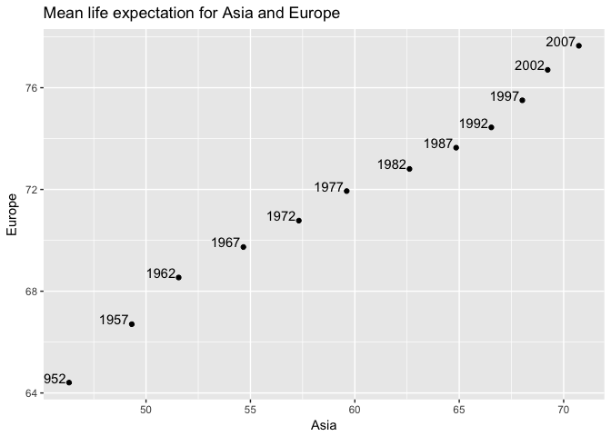

hw04
================
Xinyao Fan
2017-10-04

``` r
library(gapminder)
library(tidyverse)
```

    ## Loading tidyverse: ggplot2
    ## Loading tidyverse: tibble
    ## Loading tidyverse: tidyr
    ## Loading tidyverse: readr
    ## Loading tidyverse: purrr
    ## Loading tidyverse: dplyr

    ## Conflicts with tidy packages ----------------------------------------------

    ## filter(): dplyr, stats
    ## lag():    dplyr, stats

General data reshaping and relationship to aggregation
------------------------------------------------------

### Activity 3

Compute some measure of life expectancy (mean? median? min? max?) for all possible combinations of continent and year. Reshape that to have one row per year and one variable for each continent. Or the other way around: one row per continent and one variable per year. Use knitr::kable() to make these tables look pretty in your rendered homework.

The usual form of data:

``` r
out<-gapminder%>%
  group_by(continent,year)%>%
  summarise(mean_life=mean(lifeExp),median_life=median(lifeExp),min_life=min(lifeExp),max_life=max(lifeExp))
knitr::kable(out)
```

| continent |  year|  mean\_life|  median\_life|  min\_life|  max\_life|
|:----------|-----:|-----------:|-------------:|----------:|----------:|
| Africa    |  1952|    39.13550|       38.8330|     30.000|     52.724|
| Africa    |  1957|    41.26635|       40.5925|     31.570|     58.089|
| Africa    |  1962|    43.31944|       42.6305|     32.767|     60.246|
| Africa    |  1967|    45.33454|       44.6985|     34.113|     61.557|
| Africa    |  1972|    47.45094|       47.0315|     35.400|     64.274|
| Africa    |  1977|    49.58042|       49.2725|     36.788|     67.064|
| Africa    |  1982|    51.59287|       50.7560|     38.445|     69.885|
| Africa    |  1987|    53.34479|       51.6395|     39.906|     71.913|
| Africa    |  1992|    53.62958|       52.4290|     23.599|     73.615|
| Africa    |  1997|    53.59827|       52.7590|     36.087|     74.772|
| Africa    |  2002|    53.32523|       51.2355|     39.193|     75.744|
| Africa    |  2007|    54.80604|       52.9265|     39.613|     76.442|
| Americas  |  1952|    53.27984|       54.7450|     37.579|     68.750|
| Americas  |  1957|    55.96028|       56.0740|     40.696|     69.960|
| Americas  |  1962|    58.39876|       58.2990|     43.428|     71.300|
| Americas  |  1967|    60.41092|       60.5230|     45.032|     72.130|
| Americas  |  1972|    62.39492|       63.4410|     46.714|     72.880|
| Americas  |  1977|    64.39156|       66.3530|     49.923|     74.210|
| Americas  |  1982|    66.22884|       67.4050|     51.461|     75.760|
| Americas  |  1987|    68.09072|       69.4980|     53.636|     76.860|
| Americas  |  1992|    69.56836|       69.8620|     55.089|     77.950|
| Americas  |  1997|    71.15048|       72.1460|     56.671|     78.610|
| Americas  |  2002|    72.42204|       72.0470|     58.137|     79.770|
| Americas  |  2007|    73.60812|       72.8990|     60.916|     80.653|
| Asia      |  1952|    46.31439|       44.8690|     28.801|     65.390|
| Asia      |  1957|    49.31854|       48.2840|     30.332|     67.840|
| Asia      |  1962|    51.56322|       49.3250|     31.997|     69.390|
| Asia      |  1967|    54.66364|       53.6550|     34.020|     71.430|
| Asia      |  1972|    57.31927|       56.9500|     36.088|     73.420|
| Asia      |  1977|    59.61056|       60.7650|     31.220|     75.380|
| Asia      |  1982|    62.61794|       63.7390|     39.854|     77.110|
| Asia      |  1987|    64.85118|       66.2950|     40.822|     78.670|
| Asia      |  1992|    66.53721|       68.6900|     41.674|     79.360|
| Asia      |  1997|    68.02052|       70.2650|     41.763|     80.690|
| Asia      |  2002|    69.23388|       71.0280|     42.129|     82.000|
| Asia      |  2007|    70.72848|       72.3960|     43.828|     82.603|
| Europe    |  1952|    64.40850|       65.9000|     43.585|     72.670|
| Europe    |  1957|    66.70307|       67.6500|     48.079|     73.470|
| Europe    |  1962|    68.53923|       69.5250|     52.098|     73.680|
| Europe    |  1967|    69.73760|       70.6100|     54.336|     74.160|
| Europe    |  1972|    70.77503|       70.8850|     57.005|     74.720|
| Europe    |  1977|    71.93777|       72.3350|     59.507|     76.110|
| Europe    |  1982|    72.80640|       73.4900|     61.036|     76.990|
| Europe    |  1987|    73.64217|       74.8150|     63.108|     77.410|
| Europe    |  1992|    74.44010|       75.4510|     66.146|     78.770|
| Europe    |  1997|    75.50517|       76.1160|     68.835|     79.390|
| Europe    |  2002|    76.70060|       77.5365|     70.845|     80.620|
| Europe    |  2007|    77.64860|       78.6085|     71.777|     81.757|
| Oceania   |  1952|    69.25500|       69.2550|     69.120|     69.390|
| Oceania   |  1957|    70.29500|       70.2950|     70.260|     70.330|
| Oceania   |  1962|    71.08500|       71.0850|     70.930|     71.240|
| Oceania   |  1967|    71.31000|       71.3100|     71.100|     71.520|
| Oceania   |  1972|    71.91000|       71.9100|     71.890|     71.930|
| Oceania   |  1977|    72.85500|       72.8550|     72.220|     73.490|
| Oceania   |  1982|    74.29000|       74.2900|     73.840|     74.740|
| Oceania   |  1987|    75.32000|       75.3200|     74.320|     76.320|
| Oceania   |  1992|    76.94500|       76.9450|     76.330|     77.560|
| Oceania   |  1997|    78.19000|       78.1900|     77.550|     78.830|
| Oceania   |  2002|    79.74000|       79.7400|     79.110|     80.370|
| Oceania   |  2007|    80.71950|       80.7195|     80.204|     81.235|

We choose the variable: mean\_life. From the following table, we could know the mean life expecation for each continent every year.

``` r
out1<-out%>%
  select(year,continent,mean_life)%>%
  spread(key=continent, value=mean_life)
knitr::kable(out1)
```

|  year|    Africa|  Americas|      Asia|    Europe|  Oceania|
|-----:|---------:|---------:|---------:|---------:|--------:|
|  1952|  39.13550|  53.27984|  46.31439|  64.40850|  69.2550|
|  1957|  41.26635|  55.96028|  49.31854|  66.70307|  70.2950|
|  1962|  43.31944|  58.39876|  51.56322|  68.53923|  71.0850|
|  1967|  45.33454|  60.41092|  54.66364|  69.73760|  71.3100|
|  1972|  47.45094|  62.39492|  57.31927|  70.77503|  71.9100|
|  1977|  49.58042|  64.39156|  59.61056|  71.93777|  72.8550|
|  1982|  51.59287|  66.22884|  62.61794|  72.80640|  74.2900|
|  1987|  53.34479|  68.09072|  64.85118|  73.64217|  75.3200|
|  1992|  53.62958|  69.56836|  66.53721|  74.44010|  76.9450|
|  1997|  53.59827|  71.15048|  68.02052|  75.50517|  78.1900|
|  2002|  53.32523|  72.42204|  69.23388|  76.70060|  79.7400|
|  2007|  54.80604|  73.60812|  70.72848|  77.64860|  80.7195|

Also, we could get a table like this.

``` r
out2<-out%>%
  select(year,continent,mean_life)%>%
  spread(key=year, value=mean_life)
knitr::kable(out2)
```

| continent |      1952|      1957|      1962|      1967|      1972|      1977|      1982|      1987|      1992|      1997|      2002|      2007|
|:----------|---------:|---------:|---------:|---------:|---------:|---------:|---------:|---------:|---------:|---------:|---------:|---------:|
| Africa    |  39.13550|  41.26635|  43.31944|  45.33454|  47.45094|  49.58042|  51.59287|  53.34479|  53.62958|  53.59827|  53.32523|  54.80604|
| Americas  |  53.27984|  55.96028|  58.39876|  60.41092|  62.39492|  64.39156|  66.22884|  68.09072|  69.56836|  71.15048|  72.42204|  73.60812|
| Asia      |  46.31439|  49.31854|  51.56322|  54.66364|  57.31927|  59.61056|  62.61794|  64.85118|  66.53721|  68.02052|  69.23388|  70.72848|
| Europe    |  64.40850|  66.70307|  68.53923|  69.73760|  70.77503|  71.93777|  72.80640|  73.64217|  74.44010|  75.50517|  76.70060|  77.64860|
| Oceania   |  69.25500|  70.29500|  71.08500|  71.31000|  71.91000|  72.85500|  74.29000|  75.32000|  76.94500|  78.19000|  79.74000|  80.71950|

Is there a plot that is easier to make with the data in this shape versis the usual form? If so (or you think so), try it! Reflect.

``` r
out1%>%
  ggplot(aes(x=Asia,y=Europe)) + geom_point()+labs(title="Mean life expectation for Asia and Europe")+geom_text(aes(label=year),hjust=1.1, vjust=0)
```



The data in this shape will be easier to plot the above scatterplot. In such plot, we could get the information about life expectations in two countries simultaneously.

Join, merge, look up
--------------------

Cheatsheet for join function

We will Work with two small data.frames, hamburgers and sellers.

``` r
suppressPackageStartupMessages(library(dplyr))
library(readr)
```

``` r
hamburgers<- "
          name,        calories,     meat,       company
   Filter_Fish,             400,     fish,      Mcdonald
       Big mac,             520,     beef,      Mcdonald
    Mc_chicken,             470,  chicken,      Mcdonald
     Mc_double,             370,     beef,      Mcdonald
Triple_whopper,            1070,     beef,    BurgerKing
Crispy_chicken,             290,  chicken,    BurgerKing
    Big_crunch,             490,  chicken,           KFC
"
hamburgers <- read_csv(hamburgers, trim_ws = TRUE, skip = 1)
sellers <- "
    company, yr_founded
 BurgerKing,       1954
   Mcdonald,       1940
   pizzahut,       1960
"
sellers <- read_csv(sellers, trim_ws = TRUE, skip = 1)
```

Sub-plot: watch the row and variable order of the join results for a healthy reminder of why it’s dangerous to rely on any of that in an analysis.

### inner\_joint(hamburgers,Sellers)

*inner\_join(x, y): Return all rows from x where there are matching values in y, and all columns from x and y. If there are multiple matches between x and y, all combination of the matches are returned. This is a mutating join*

``` r
(ijhs <- inner_join(hamburgers,sellers))
```

    ## Joining, by = "company"

    ## # A tibble: 6 x 5
    ##             name calories    meat    company yr_founded
    ##            <chr>    <int>   <chr>      <chr>      <int>
    ## 1    Filter_Fish      400    fish   Mcdonald       1940
    ## 2        Big mac      520    beef   Mcdonald       1940
    ## 3     Mc_chicken      470 chicken   Mcdonald       1940
    ## 4      Mc_double      370    beef   Mcdonald       1940
    ## 5 Triple_whopper     1070    beef BurgerKing       1954
    ## 6 Crispy_chicken      290 chicken BurgerKing       1954

We lose Big\_crunch in the join because, although he appears in x = hambugers, his seller KFC does not appear in y = sellers. The join result has all variables from x = hamburgers plus yr\_founded, from y.

### semi\_join(hamburgers, sellers)

*semi\_join(x, y): Return all rows from x where there are matching values in y, keeping just columns from x. A semi join differs from an inner join because an inner join will return one row of x for each matching row of y, where a semi join will never duplicate rows of x. This is a filtering join.*

``` r
(sjhs<-semi_join(hamburgers,sellers))
```

    ## Joining, by = "company"

    ## # A tibble: 6 x 4
    ##             name calories    meat    company
    ##            <chr>    <int>   <chr>      <chr>
    ## 1    Filter_Fish      400    fish   Mcdonald
    ## 2        Big mac      520    beef   Mcdonald
    ## 3     Mc_chicken      470 chicken   Mcdonald
    ## 4      Mc_double      370    beef   Mcdonald
    ## 5 Triple_whopper     1070    beef BurgerKing
    ## 6 Crispy_chicken      290 chicken BurgerKing

We get a similar result as with inner\_join() but the join result contains only the variables originally found in x = hamburgers. But note the row order has changed

### left\_join(hamburgers, sellers)

*left\_join(x, y): Return all rows from x, and all columns from x and y. If there are multiple matches between x and y, all combination of the matches are returned. This is a mutating join.*

``` r
(ljhs <- left_join(hamburgers, sellers))
```

    ## Joining, by = "company"

    ## # A tibble: 7 x 5
    ##             name calories    meat    company yr_founded
    ##            <chr>    <int>   <chr>      <chr>      <int>
    ## 1    Filter_Fish      400    fish   Mcdonald       1940
    ## 2        Big mac      520    beef   Mcdonald       1940
    ## 3     Mc_chicken      470 chicken   Mcdonald       1940
    ## 4      Mc_double      370    beef   Mcdonald       1940
    ## 5 Triple_whopper     1070    beef BurgerKing       1954
    ## 6 Crispy_chicken      290 chicken BurgerKing       1954
    ## 7     Big_crunch      490 chicken        KFC         NA

We basically get x = hamburgers back, but with the addition of variable yr\_founded, which is unique to y = sellers. Big\_chrunk, whose seller does not appear in y = sellers, has an NA for yr\_founded.

### anti\_join(hamburgers, sellers)

*anti\_join(x, y): Return all rows from x where there are not matching values in y, keeping just columns from x. This is a filtering join.*

``` r
(ajhs <- anti_join(hamburgers,sellers))
```

    ## Joining, by = "company"

    ## # A tibble: 1 x 4
    ##         name calories    meat company
    ##        <chr>    <int>   <chr>   <chr>
    ## 1 Big_crunch      490 chicken     KFC

We keep only Big\_crunch now (and do not get yr\_founded).

### inner\_join(sellers, hamburgers)

*inner\_join(x, y): Return all rows from x where there are matching values in y, and all columns from x and y. If there are multiple matches between x and y, all combination of the matches are returned. This is a mutating join.*

``` r
(ijsh <- inner_join(sellers,hamburgers))
```

    ## Joining, by = "company"

    ## # A tibble: 6 x 5
    ##      company yr_founded           name calories    meat
    ##        <chr>      <int>          <chr>    <int>   <chr>
    ## 1 BurgerKing       1954 Triple_whopper     1070    beef
    ## 2 BurgerKing       1954 Crispy_chicken      290 chicken
    ## 3   Mcdonald       1940    Filter_Fish      400    fish
    ## 4   Mcdonald       1940        Big mac      520    beef
    ## 5   Mcdonald       1940     Mc_chicken      470 chicken
    ## 6   Mcdonald       1940      Mc_double      370    beef

In a way, this does illustrate multiple matches, if you think about it from the x = sellers direction. Every seller that has a match in y = hamburgers multiple times in the result, once for each match. In fact, we’re getting the same result as with inner\_join(hamburgers,sellers), up to variable order (which you should also never rely on in an analysis).

### semi\_join(sellers, hamburgers)

*semi\_join(x, y): Return all rows from x where there are matching values in y, keeping just columns from x. A semi join differs from an inner join because an inner join will return one row of x for each matching row of y, where a semi join will never duplicate rows of x. This is a filtering join.*

``` r
(sjps <- semi_join(x = sellers, y = hamburgers))
```

    ## Joining, by = "company"

    ## # A tibble: 2 x 2
    ##      company yr_founded
    ##        <chr>      <int>
    ## 1 BurgerKing       1954
    ## 2   Mcdonald       1940

Now the effects of switching the x and y roles is more clear. The result resembles x = sellers, but the seller pizzahut is lost, because there are no observations where seller == "pizzahut" in y = hamburgers.

### left\_join(sellers, hamburgeres)

*left\_join(x, y): Return all rows from x, and all columns from x and y. If there are multiple matches between x and y, all combination of the matches are returned. This is a mutating join.*

``` r
(ljsh <- left_join(sellers, hamburgers))
```

    ## Joining, by = "company"

    ## # A tibble: 7 x 5
    ##      company yr_founded           name calories    meat
    ##        <chr>      <int>          <chr>    <int>   <chr>
    ## 1 BurgerKing       1954 Triple_whopper     1070    beef
    ## 2 BurgerKing       1954 Crispy_chicken      290 chicken
    ## 3   Mcdonald       1940    Filter_Fish      400    fish
    ## 4   Mcdonald       1940        Big mac      520    beef
    ## 5   Mcdonald       1940     Mc_chicken      470 chicken
    ## 6   Mcdonald       1940      Mc_double      370    beef
    ## 7   pizzahut       1960           <NA>       NA    <NA>

We get a similar result as with inner\_join() but the seller pizzahut survives in the join, even though no harmburgers from pizzahut appear in y = hamburgers. As a result, pizzahut has NAs for any other features.

### anti\_join(sellers, hamburgers)

*anti\_join(x, y): Return all rows from x where there are not matching values in y, keeping just columns from x. This is a filtering join.*

``` r
(ajsh <- anti_join(sellers, hamburgers))
```

    ## Joining, by = "company"

    ## # A tibble: 1 x 2
    ##    company yr_founded
    ##      <chr>      <int>
    ## 1 pizzahut       1960

We keep only seller pizzahut now (and the variables found in x = publishers).

### full\_join(hamburgeres, sellers)

*full\_join(x, y): Return all rows and all columns from both x and y. Where there are not matching values, returns NA for the one missing. This is a mutating join.*

``` r
(fjhs <- full_join(hamburgers, sellers))
```

    ## Joining, by = "company"

    ## # A tibble: 8 x 5
    ##             name calories    meat    company yr_founded
    ##            <chr>    <int>   <chr>      <chr>      <int>
    ## 1    Filter_Fish      400    fish   Mcdonald       1940
    ## 2        Big mac      520    beef   Mcdonald       1940
    ## 3     Mc_chicken      470 chicken   Mcdonald       1940
    ## 4      Mc_double      370    beef   Mcdonald       1940
    ## 5 Triple_whopper     1070    beef BurgerKing       1954
    ## 6 Crispy_chicken      290 chicken BurgerKing       1954
    ## 7     Big_crunch      490 chicken        KFC         NA
    ## 8           <NA>       NA    <NA>   pizzahut       1960

We get all rows of x = hamburgers plus a new row from y = sellers, containing the seller pizzahut. We get all variables from x = hamburgers AND all variables from y = sellers. Any row that derives solely from one table or the other carries NAs in the variables found only in the other table.

Report of Process
-----------------

I think this homework is not very difficult. I found a useful [tutorial](https://github.com/jennybc/lotr-tidy) to learn about reshaping tables, there are some functions such as gather(), spread() to deal with such issues. <br> For another part, I created my own cheatsheet about different types of join. I designed two small data frames and use them to explore about left\_jion, full\_join, anti\_join, inner\_join, semi\_join. Also, I changed the order of the two data frames in the function to see what will happen. However, I found it hard to put three tables side by side in the rmd file, I didn't find a quick or easy way to do that.
