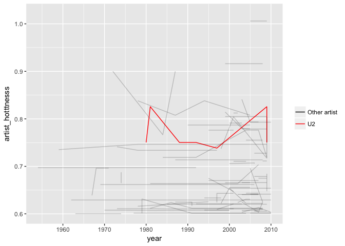

hw05
================
Xinyao Fan
2017-10-12

R Markdown
----------

``` r
library(singer)
library(tidyverse)
```

    ## Loading tidyverse: ggplot2
    ## Loading tidyverse: tibble
    ## Loading tidyverse: tidyr
    ## Loading tidyverse: readr
    ## Loading tidyverse: purrr
    ## Loading tidyverse: dplyr

    ## Conflicts with tidy packages ----------------------------------------------

    ## filter(): dplyr, stats
    ## lag():    dplyr, stats

``` r
library("readxl")
library(forcats)
library(RColorBrewer)
```

Factor Management(Singer Version)
---------------------------------

### Factorise

**Transform some of the variable in the singer\_locations dataframe into factors: pay attention at what levels you introduce and their order. Try and consider the difference between the base R as.factor and the forcats-provided functions.**

``` r
data("singer_locations")
sl<-singer_locations%>%
  mutate(artist_name_1=as_factor(artist_name)) ##function in package "forcats"
head(sl$artist_name_1)
```

    ## [1] Motion City Soundtrack         Gene Chandler                 
    ## [3] Paul Horn                      Ronnie Earl & the Broadcasters
    ## [5] Dorothy Ashby                  Barleyjuice                   
    ## 7498 Levels: Motion City Soundtrack Gene Chandler ... Charlie Hall

``` r
glimpse(sl$artist_name_1)
```

    ##  Factor w/ 7498 levels "Motion City Soundtrack",..: 1 2 3 4 5 6 7 8 9 10 ...

As the result above, it has 7498 levels. Now, we try to explore the difference between as\_factor, factor and as.factor.

``` r
a<-c("small","medium","large")
as.factor(a)
```

    ## [1] small  medium large 
    ## Levels: large medium small

``` r
as_factor(a)
```

    ## [1] small  medium large 
    ## Levels: small medium large

``` r
factor(a)
```

    ## [1] small  medium large 
    ## Levels: large medium small

We could find that as.factor and factor will change the order of the levels while as\_factor will keep the original order of levels.

### Drop 0.

**Filter the singer\_locations data to remove observations associated with the uncorrectly inputed year 0. Additionally, remove unused factor levels. Provide concrete information on the data before and after removing these rows and levels; address the number of rows and the levels of the affected factors.**

``` r
dim(sl)
```

    ## [1] 10100    15

``` r
nlevels(sl$artist_name_1)
```

    ## [1] 7498

``` r
sl_drop<-sl%>%
  filter(year!=0)%>%
  droplevels()
dim(sl_drop)
```

    ## [1] 10000    15

``` r
nlevels(sl_drop$artist_name_1)
```

    ## [1] 7408

From the above result, we know that original data has 10100 rows and 7498 levels. After dropping the data(year=0) and unused levels, the new data has 10000 rows and 7408 levels, so 90 levels affected for the variable.

### Reorder the levels of year, artist\_name or title.

**Use the forcats package to change the order of the factor levels, based on a principled summary of one of the quantitative variables. Consider experimenting with a summary statistic beyond the most basic choice of the median.**

``` r
head(levels(sl_drop$artist_name_1)) # previous order
```

    ## [1] "Motion City Soundtrack"         "Gene Chandler"                 
    ## [3] "Paul Horn"                      "Ronnie Earl & the Broadcasters"
    ## [5] "Dorothy Ashby"                  "Barleyjuice"

``` r
# reorder
head(levels(fct_reorder(sl_drop$artist_name_1, sl_drop$artist_hotttnesss, max,.desc = TRUE)))
```

    ## [1] "Daft Punk"       "Black Eyed Peas" "Coldplay"        "Rihanna"        
    ## [5] "Rihanna / Slash" "Michael Jackson"

We use the hotttnesss of the artist to reorder the factor levels and get the above results.

### Common Part

**Explore the effects of arrange(). Does merely arranging the data have any effect on, say, a figure?**

``` r
sl_drop%>% #use arrange
  filter(artist_hotttnesss>0.85) %>%
  arrange(artist_hotttnesss) %>% 
  ggplot(aes(y=artist_name_1,x=artist_hotttnesss)) + geom_point()
```


From the above result, arrange() will not change the order of levels and thus has no impact on the figures.

**Explore the effects of reordering a factor and factor reordering coupled with arrange(). Especially, what effect does this have on a figure?**

``` r
sl_drop%>% #use fac_order
  filter(artist_hotttnesss>0.85) %>%
  ggplot(aes(y=fct_reorder(artist_name_1, artist_hotttnesss, max,.desc = TRUE),x=artist_hotttnesss)) + geom_point()+scale_y_discrete("artist_name")
```


``` r
sl_drop%>% 
  arrange(artist_hotttnesss)%>%
  filter(artist_hotttnesss>0.85) %>%
  ggplot(aes(x=artist_hotttnesss,y=fct_reorder(artist_name_1, artist_hotttnesss, max,.desc = TRUE))) + geom_point()+scale_y_discrete("artist_name")
```


However, if we use fct\_reorder() function coupled with arrange(), arrange() doesn't change the order of the levels either and has no effect on the plots.

File I/O
--------

**Experiment with one or more of write\_csv()/read\_csv() (and/or TSV friends), saveRDS()/readRDS(), dput()/dget(). Create something new, probably by filtering or grouped-summarization of Singer or Gapminder.**

``` r
sl2<-sl_drop%>%
  filter(artist_hotttnesss>0.85)%>%
  group_by(artist_name_1)%>%
  select(artist_name_1,artist_hotttnesss)%>%
  summarise(hotttnesss=mean(artist_hotttnesss))
```

``` r
# use write_csv
write_csv(sl2,"sl2.csv")
read_csv("sl2.csv")
```

    ## Parsed with column specification:
    ## cols(
    ##   artist_name_1 = col_character(),
    ##   hotttnesss = col_double()
    ## )

    ## # A tibble: 8 x 2
    ##     artist_name_1 hotttnesss
    ##             <chr>      <dbl>
    ## 1        Coldplay  0.9160532
    ## 2 Michael Jackson  0.8999916
    ## 3       Daft Punk  1.0212556
    ## 4    Taylor Swift  0.8724472
    ## 5            T.I.  0.8728389
    ## 6         Rihanna  0.9082026
    ## 7 Black Eyed Peas  1.0059420
    ## 8 Rihanna / Slash  0.9082026

``` r
# use saveRDS
saveRDS(sl2,"sl2.rds")
readRDS("sl2.rds")
```

    ## # A tibble: 8 x 2
    ##     artist_name_1 hotttnesss
    ##            <fctr>      <dbl>
    ## 1        Coldplay  0.9160532
    ## 2 Michael Jackson  0.8999916
    ## 3       Daft Punk  1.0212556
    ## 4    Taylor Swift  0.8724472
    ## 5            T.I.  0.8728389
    ## 6         Rihanna  0.9082026
    ## 7 Black Eyed Peas  1.0059420
    ## 8 Rihanna / Slash  0.9082026

``` r
#use deput
dput(sl2,"sl2.txt")
dget("sl2.txt")
```

    ## # A tibble: 8 x 2
    ##     artist_name_1 hotttnesss
    ##            <fctr>      <dbl>
    ## 1        Coldplay  0.9160532
    ## 2 Michael Jackson  0.8999916
    ## 3       Daft Punk  1.0212556
    ## 4    Taylor Swift  0.8724472
    ## 5            T.I.  0.8728389
    ## 6         Rihanna  0.9082026
    ## 7 Black Eyed Peas  1.0059420
    ## 8 Rihanna / Slash  0.9082026

Visualization design
--------------------

**Remake at least one figure or create a new one, in light of something you learned in the recent class meetings about visualization design and color. Maybe juxtapose your first attempt and what you obtained after some time spent working on it. Reflect on the differences.**

``` r
sl_drop%>%
  filter(artist_hotttnesss>0.8)%>%
  ggplot(aes(artist_familiarity, artist_hotttnesss)) + geom_point(aes(colour=year))+scale_colour_distiller(palette="Greens", direction=1)
```


We only care about the aristist whose hotttnesss is beyond 0.6 and draw a spaghetti plot.

``` r
sl3<-sl_drop %>% 
  filter(artist_hotttnesss>0.6)
  ggplot(sl3,aes(x=year,y=artist_hotttnesss))+geom_line(aes(group=artist_name_1),alpha=0.2)
```


Now, I pick one artist called "U2" and try to highlight her hotttnesss changes over time by red line.

``` r
colour_layer <- scale_colour_manual("",labels=c("Other artist","U2"),values=c("black","red"))

p<-ggplot(sl3,aes(x=year,y=artist_hotttnesss))+geom_line(aes(group=artist_name_1,colour=artist_name_1=="U2",alpha=artist_name_1=="U2"))+colour_layer+scale_alpha_discrete(range = c(0.2,1),guide=F)
p
```



Next, we try to focus on the top 5 artists and plot their hotttness and familiarity. To make the plot more clear, we ignore other artists, so we use a filter.

``` r
sl_long <- sl_drop %>%
  mutate(top_artist = fct_lump(artist_name_1, n=5)) %>%
  select(year, artist_hotttnesss, artist_familiarity,top_artist) %>%
  gather(key = "Measure", value = "values",artist_familiarity:artist_hotttnesss)

sl_long%>%
  filter(top_artist!="Other")%>%
  ggplot(aes(x = year, y = values, colour=top_artist)) + geom_point() + facet_wrap(~Measure,scales = "free")+scale_fill_brewer(palette = "Dark2")
```


Writing figures to file
-----------------------

**Use ggsave() to explicitly save a plot to file. Then load and embed it in your report.** I will try to save the spaghetti plot above.

``` r
ggsave("my plot.pdf", width=15, height=10, units="cm", plot=p)
ggsave("my plot.png", width=15, height=10, units="cm", plot=p)
```


Report of Process
-----------------

In this homework, I found it easy to change a character variable into factor variable. Also, we could use levels() to have an overview of the levels of factor variable. Write and read a file is also not very hard. We should pay attention to some 'dplr' function such as arrange() ,it does not work when we use the fct\_reorder function of 'forcats'.<br> The most difficult part is data visualization. Because we should have a good understanding of the dataset first, then we may find out what kinds of plot is really meaningful. After that, we should deal with the dataset using 'dplr' and gather(),spread() to make the data more easier to plot. And we are also supposed to choose a proper type of ggplot in order to explain our data(such as trend, comparisions) more clearly. So, this can be a complex process, and not easy for me.
