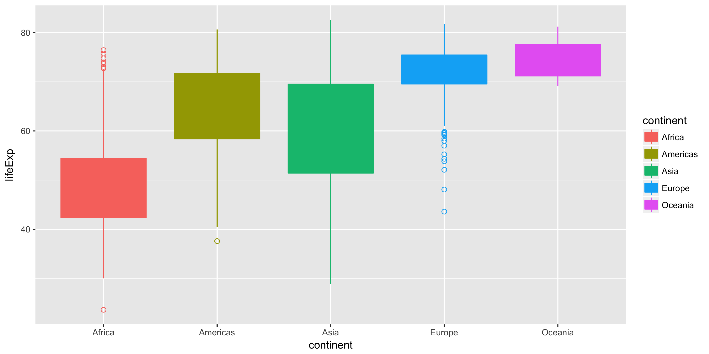
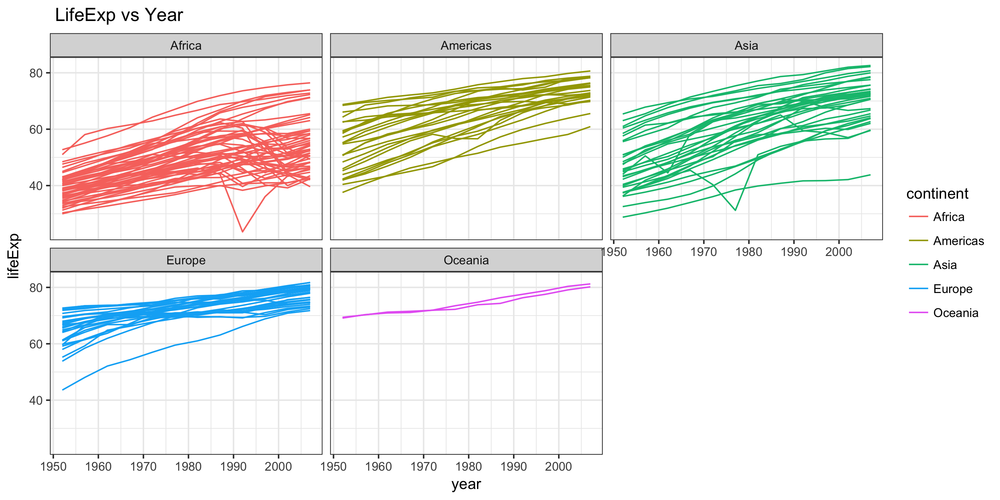
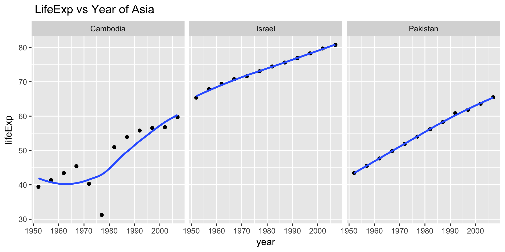
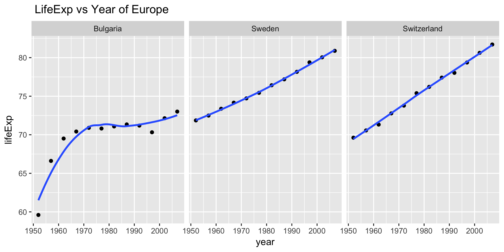
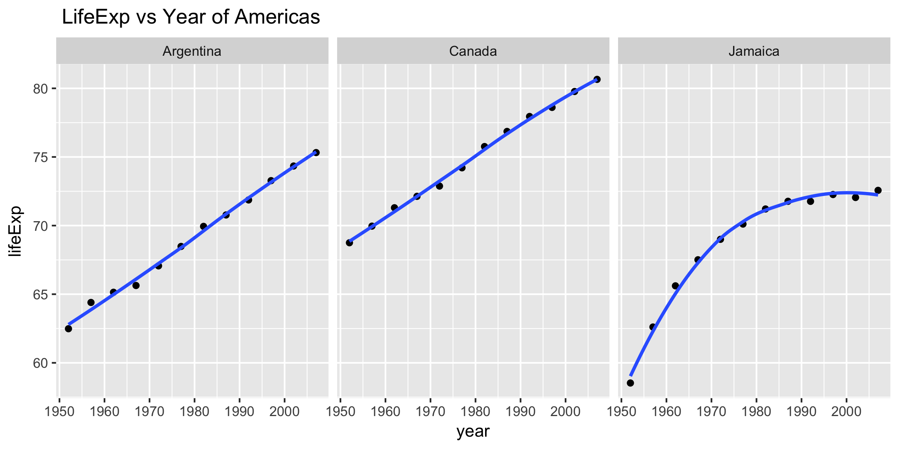
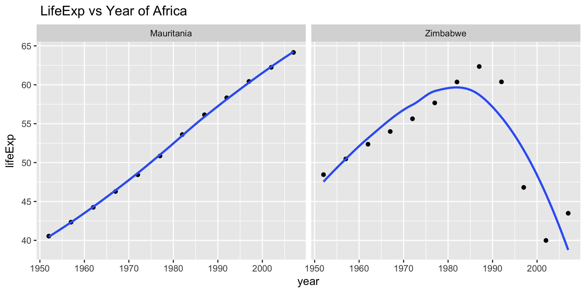
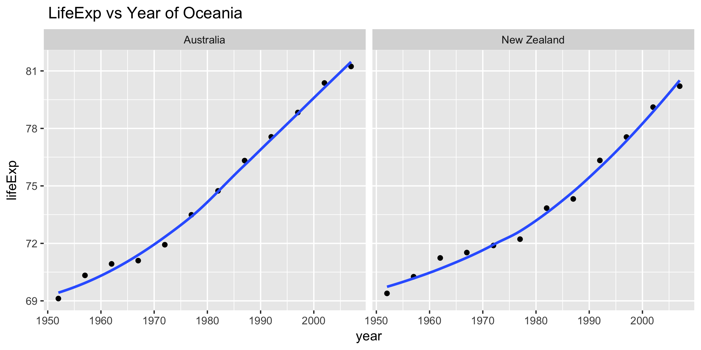

###Introduction
We will deal with the dataset "gapminder" in this homework, and try to explore the relationship of lifExp and year.

###Descriptive plots




###Perform exploratory analyses
In this part, I reorder the continents based on their life expectancy.(mean)
and choose the variable we need, that's country, continent, year, lifExp.
```{r load_gapminder_data}
gap_data<-read.delim("gapminder_dat.tsv")
table1<-head(as.data.frame(gap_data),n=10)
table1
```

###Perform statistical analyses

In this part, I fit a linear regression of life expectancy on year within each country. Write the estimated intercepts, slopes, and residual error variance (or sd) to file. 
```{r load-data}
coef_data<-read.delim("gap_coefs.tsv")
table2<-head(as.data.frame(coef_data),n=10)
table2
```

Also, I find the 3 “worst” and “best” countries for each continent. For each continent, I choose two "best" countries whose sd is the top2 smallest and one "worst" country whose sd is the largest one.
```{r}
country_data<-read.delim("worst_best_countries.tsv")
table3<-as.data.frame(country_data)
table3
```

###Generate Figures
In this part, I create a figure for each continent. And in each figure,I give scatterplots of life expectancy vs. year, faceting on some country(I chose the countries in the above table, that's best and worst countries in each continent) fitted line overlaid.






###Report of Process
In this homework, I first create 3 R scripts: explor_analyse.r, stat_analyses.r, Graph.R to do some small data analysis.<br>

**In explore_analyse.r:** read the data, reorder the continents based on life expectancy and write numerical data to file in CSV or TSV format.
**In stat_analyses.r:** Give estimated intercepts, slopes, and residual error variance of linear regression (lifExp vs year) for each country.
**Graph.R:** Create scatterplots of life expectancy vs. year for each continent.<br>
Then I write a Makefile to automate my pipeline using make and genearate the final report.html.

The most difficult part for me is to choose the best and worst countries for each continent. Since one selected criteria could not be applied to each continent, so I find the worst and best countries for each continent seperately. I was wondering whether there is a more eaiser way to do this thing. Also, in my report, I give each figure a name but it doesn't show in my final report. Though it is not a easy task for me, it's really happy to try using "makefile" to do some thing! 