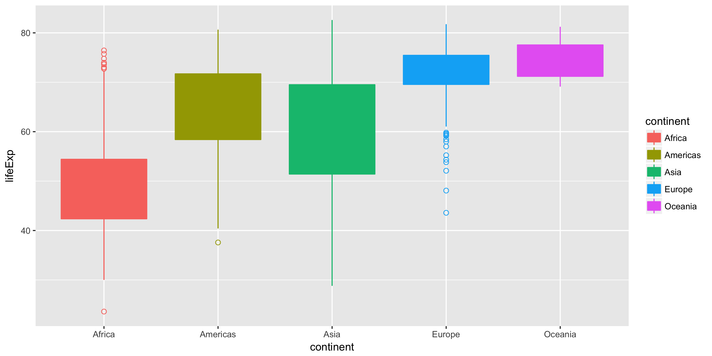
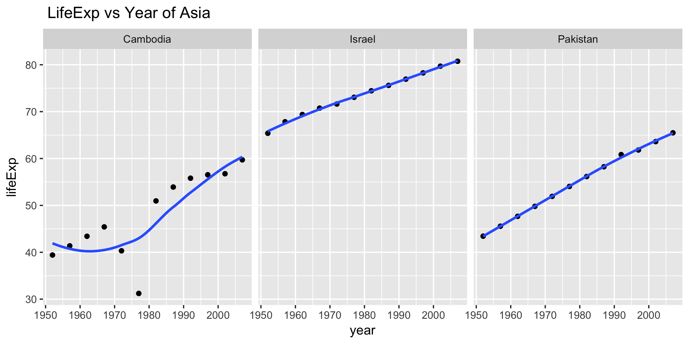
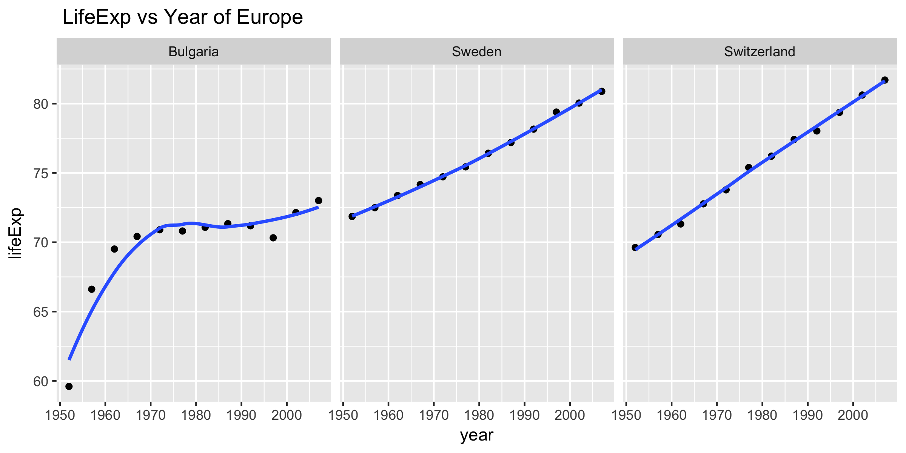
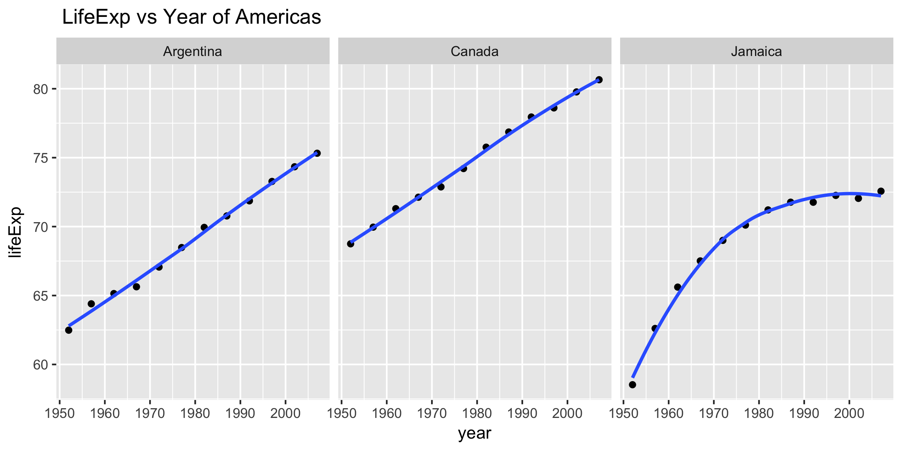
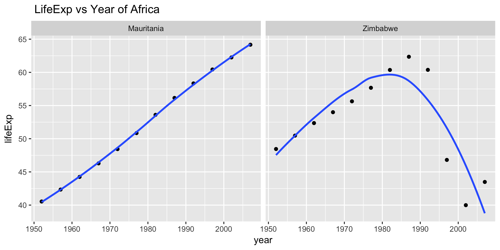

Hw07
================
Xinyao Fan
November 12, 2017

### Introduction

We will deal with the dataset "gapminder" in this homework, and try to explore the relationship of lifExp and year.

### Descriptive plots

 

### Perform exploratory analyses

In this part, I reorder the continents based on their life expectancy.(mean) and choose the variable we need, that's country, continent, year, lifExp.

``` r
gap_data<-read.delim("gapminder_dat.tsv")
table1<-head(as.data.frame(gap_data),n=10)
table1
```

    ##    country continent year lifeExp
    ## 1  Algeria    Africa 1952  43.077
    ## 2  Algeria    Africa 1957  45.685
    ## 3  Algeria    Africa 1962  48.303
    ## 4  Algeria    Africa 1967  51.407
    ## 5  Algeria    Africa 1972  54.518
    ## 6  Algeria    Africa 1977  58.014
    ## 7  Algeria    Africa 1982  61.368
    ## 8  Algeria    Africa 1987  65.799
    ## 9  Algeria    Africa 1992  67.744
    ## 10 Algeria    Africa 1997  69.152

### Perform statistical analyses

In this part, I fit a linear regression of life expectancy on year within each country. Write the estimated intercepts, slopes, and residual error variance (or sd) to file.

``` r
coef_data<-read.delim("gap_coefs.tsv")
table2<-head(as.data.frame(coef_data),n=10)
table2
```

    ##    continent                  country X.Intercept. I.year...1950.
    ## 1     Africa                  Algeria     42.23641     0.56927972
    ## 2     Africa                   Angola     31.70797     0.20933986
    ## 3     Africa                    Benin     38.92005     0.33423287
    ## 4     Africa                 Botswana     52.80778     0.06066853
    ## 5     Africa             Burkina Faso     33.95674     0.36397483
    ## 6     Africa                  Burundi     40.27037     0.15413427
    ## 7     Africa                 Cameroon     40.74917     0.25014685
    ## 8     Africa Central African Republic     38.44170     0.18390559
    ## 9     Africa                     Chad     39.30288     0.25324406
    ## 10    Africa                  Comoros     39.09522     0.45039091
    ##           sd
    ## 1  1.3230064
    ## 2  1.4070091
    ## 3  1.1746910
    ## 4  6.1121773
    ## 5  2.0470915
    ## 6  1.6107778
    ## 7  3.2432136
    ## 8  3.5245290
    ## 9  1.8314395
    ## 10 0.4786468

Also, I find the 3 “worst” and “best” countries for each continent. For each continent, I choose two "best" countries whose sd is the top2 smallest and one "worst" country whose sd is the largest one.

``` r
country_data<-read.delim("worst_best_countries.tsv")
table3<-as.data.frame(country_data)
table3
```

    ##    continent           country X.Intercept. I.year...1950.        sd
    ## 1       Asia            Israel     65.76620     0.26710629 0.3657401
    ## 2       Asia          Pakistan     42.91138     0.40579231 0.4029337
    ## 3       Asia          Cambodia     36.22362     0.39590280 5.6301432
    ## 4     Africa Equatorial Guinea     33.80997     0.31017063 0.3286898
    ## 5     Africa        Mauritania     39.13277     0.44641748 0.4075323
    ## 6     Africa          Zimbabwe     55.40729    -0.09302098 7.2054307
    ## 7     Europe            Sweden     71.27249     0.16625455 0.2117679
    ## 8     Europe       Switzerland     69.00926     0.22223147 0.2149115
    ## 9     Europe          Bulgaria     65.44593     0.14568881 2.5091166
    ## 10    Europe        Montenegro     61.65563     0.29300140 2.7538317
    ## 11  Americas            Canada     68.44611     0.21886923 0.2492483
    ## 12  Americas         Argentina     62.22502     0.23170839 0.2923072
    ## 13  Americas           Jamaica     62.21820     0.22139441 2.0559436
    ## 14   Oceania         Australia     67.94507     0.22772378 0.6206086
    ## 15   Oceania       New Zealand     68.30128     0.19282098 0.8043472

### Generate Figures

In this part, I create a figure for each continent. And in each figure,I give scatterplots of life expectancy vs. year, faceting on some country(I chose the countries in the above table, that's best and worst countries in each continent) fitted line overlaid.     

### Report of Process

In this homework, I first create 3 R scripts: explor\_analyse.r, stat\_analyses.r, Graph.R to do some small data analysis.<br>

**In explore\_analyse.r:** read the data, reorder the continents based on life expectancy and write numerical data to file in CSV or TSV format. **In stat\_analyses.r:** Give estimated intercepts, slopes, and residual error variance of linear regression (lifExp vs year) for each country. **Graph.R:** Create scatterplots of life expectancy vs. year for each continent.<br> Then I write a Makefile to automate my pipeline using make and genearate the final report.html.

The most difficult part for me is to choose the best and worst countries for each continent. Since one selected criteria could not be applied to each continent, so I find the worst and best countries for each continent seperately. I was wondering whether there is a more eaiser way to do this thing. Also, in my report, I give each figure a name but it doesn't show in my final report. Though it is not a easy task for me, it's really happy to try using "makefile" to do some thing!
