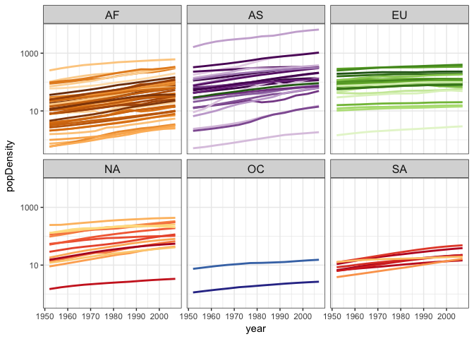
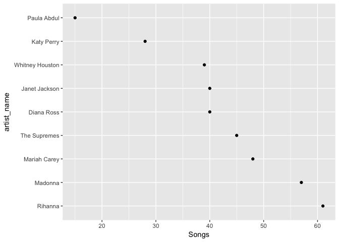

hw10
================
Xinyao Fan
December 5, 2017

Use an R package that wraps an API
----------------------------------

Many APIs have purpose-built R packages that make it even easier to get data from them. I created an account and get the data from Geonames. I found in GNcountryInfo dataset, the countryname is not match with our gapminder dataset, thus I use countrycode function to add a new column "country" in our dataset.

``` r
options(geonamesUsername = "xinyao")
GNInfo<- GNcountryInfo() %>%
    mutate(country = countrycode(isoAlpha3,'iso3c','country.name'))
```

    ## Warning in countrycode(isoAlpha3, "iso3c", "country.name"): Some values were not matched unambiguously: XKX

Now, we could join the two dataset and get a new dataset to do analysis.

``` r
newdata<-left_join(GNInfo,gapminder,by='country')
```

    ## Warning: Column `country` joining character vector and factor, coercing
    ## into character vector

After that, we calculate the popluation density. Formula:pop/areaInSqkm

``` r
newdata$areaInSqKm<-as.numeric(newdata$areaInSqKm)
newdata<-newdata%>%
  select(country,pop,areaInSqKm,year,continent.x)%>%
  na.omit()%>%
  mutate(popDensity=pop/areaInSqKm)
```

Finally, we could draw a plot, replace the pop by the pop density.

``` r
ggplot(subset(newdata, continent.x != "Oceania"),
       aes(x = year, y = popDensity, group = country, color = country)) +
  geom_line(lwd = 1, show.legend = FALSE) + facet_wrap(~ continent.x) +
  scale_color_manual(values = country_colors) + theme_bw() +
  theme(strip.text = element_text(size = rel(1.1))) + scale_y_log10()
```



Scrape data from the website
----------------------------

I am interested in the 200 greatest women artists, so I try to download the data from the billboard website and then do some data analysis.

``` r
my_url <- "https://www.billboard.com/charts/greatest-billboard-200-women-artists"
page_title <- read_html(my_url)
```

First, I extract the artist name,the rank and also the link for each artist from the website and put all the data into a dataframe. Use stringr package to set the right link for each singer.

``` r
get_artist <- function(my_link) {
  my_link %>% 
    read_html() %>% 
    html_nodes(css = ".chart-row__artist") %>% 
    html_text() %>%
    str_trim(side = "both") %>% 
    return()
}

get_rank <- function(my_link) {
  my_link %>% 
    read_html() %>% 
    html_nodes(css = ".chart-row__current-week") %>% 
    html_text() %>% 
    return()
}
Artist <- get_artist(my_url)
rank <- get_rank(my_url)
df <- data_frame(rank = rank,
                 Artist = Artist,
            Link=glue("https://www.billboard.com/music/{Artist}")%>% 
                   str_to_lower() %>% 
                   str_replace_all(" ","-") %>% 
                   str_replace_all("&","") %>% 
                   str_replace_all("'","") %>% 
                   str_replace_all("--","-") %>% 
                   str_replace_all(",","") %>% 
                   str_replace_all("!",""))
```

However, I notice that the artist Mary J. Blige's link is not match wiht the artist name, so I try to replace the link with the correct one.

``` r
df$Link[18] <- "https://www.billboard.com/music/mary-j-blige"
```

Next, I extracted the statistics nested in each artist's page: No1hit,Top10hits,songs and put all this information into a dataframe.

``` r
get_stats <- function(link) {
  link %>% 
    read_html() %>% 
    html_nodes(css = ".artist-section--chart-history__stats__stat--number") %>% 
    html_text() %>% 
    return()
}
```

Use possibly to handle with the missing information.

``` r
get_stats_safe <- purrr::possibly(get_stats, "None available")

df <- df %>% 
  mutate(Stats = map(Link, get_stats_safe))
```

Since some artists don't have data of No1Hit and Top10Hits. So, we have to judge the length of the vector Stats. For the missing information,such as NO1Hit, Top10Hits, we replace the NA by "O".

``` r
No1Hits<-c()
Top10Hits<-c()
Songs<-c()

for (i in 1:50) {
    if(length(df$Stats[[i]])==3){
    No1Hits[i]<-df$Stats[[i]][1]
    Top10Hits[i]<-df$Stats[[i]][2]
    Songs[i]<-df$Stats[[i]][3]
    }else if(length(df$Stats[[i]])==2)
  { No1Hits[i]<-0
     Top10Hits[i]<-df$Stats[[i]][1]
    Songs[i]<-df$Stats[[i]][2]
    }else if(length(df$Stats[[i]])==1)
    { 
        No1Hits[i]<-0
        Top10Hits[i]<-0
      Songs[i]<-df$Stats[[i]][1]
    
    }
 
}

df_new<- data_frame(rank = rank,
                 Artist = Artist,
                 Link = glue("https://www.billboard.com/music/{Artist}") %>% 
                   str_to_lower() %>% 
                   str_replace_all(" ","-") %>% 
                   str_replace_all("&","") %>% 
                   str_replace_all("'","") %>% 
                   str_replace_all("--","-") %>% 
                   str_replace_all(",","") %>% 
                   str_replace_all("!",""),
                 No1Hits=as.numeric(No1Hits),
                 Top10Hits=as.numeric(Top10Hits),
                 Songs=as.numeric(Songs))
write_csv(df_new, "women_200.csv")
```

Data Analysis
-------------

First, we give an overview of the distribution for Top 10 Hits in our data.

``` r
ggplot(df_new, aes(Top10Hits))+geom_histogram()+
  ggtitle("Histogram of Top 10 Hits for greates 200 women") +
  theme(plot.title = element_text(hjust = 0.5))
```

    ## `stat_bin()` using `bins = 30`. Pick better value with `binwidth`.


Then, we filter the artists whose No.1 Hits songs&gt;5 and look the detailed information. Arrange by \# of No.1 Hits songs.

``` r
out1<-df_new%>%
    filter(No1Hits>5)%>%
    select(rank,Artist,No1Hits,Top10Hits,Songs)%>%
  arrange(No1Hits)
knitr::kable(out1)
```

| rank | Artist          |  No1Hits|  Top10Hits|  Songs|
|:-----|:----------------|--------:|----------:|------:|
| 28   | Paula Abdul     |        6|          8|     15|
| 40   | Diana Ross      |        6|         12|     40|
| 38   | Katy Perry      |        9|         14|     28|
| 8    | Janet Jackson   |       10|         27|     40|
| 4    | Whitney Houston |       11|         23|     39|
| 5    | Madonna         |       12|         38|     57|
| 17   | The Supremes    |       12|         20|     45|
| 13   | Rihanna         |       14|         31|     61|
| 3    | Mariah Carey    |       18|         27|     48|

We found that Mariah Carey has the most No.1 Hit songs. Now, for these singers, we arrange them by the number of their songs and draw a plot.

``` r
df_new%>% #use fac_order
  filter(No1Hits>5) %>%
  ggplot(aes(y=fct_reorder(Artist, Songs, max,.desc = TRUE),x=Songs)) + geom_point()+scale_y_discrete("artist_name")
```



Now, we want to explore the ratio of Top10 hits songs vs all the singer's songs and arrange them.

``` r
out2<-df_new%>%
    mutate(prob=(-Top10Hits/Songs))%>%
    arrange(prob)%>%
    filter(abs(prob)>0.55)%>%
    select(rank,Artist,Top10Hits,Songs)%>%
    mutate(prob=Top10Hits/Songs)
knitr::kable(out2)
```

| rank | Artist          |  Top10Hits|  Songs|       prob|
|:-----|:----------------|----------:|------:|----------:|
| 41   | Destiny's Child |         10|     14|  0.7142857|
| 8    | Janet Jackson   |         27|     40|  0.6750000|
| 5    | Madonna         |         38|     57|  0.6666667|
| 47   | Evanescence     |          3|      5|  0.6000000|
| 4    | Whitney Houston |         23|     39|  0.5897436|
| 3    | Mariah Carey    |         27|     48|  0.5625000|
| 43   | TLC             |          9|     16|  0.5625000|

We could find that Destiney's child only have 14 songs, but 10 of them are the TOP10Hits songs!
