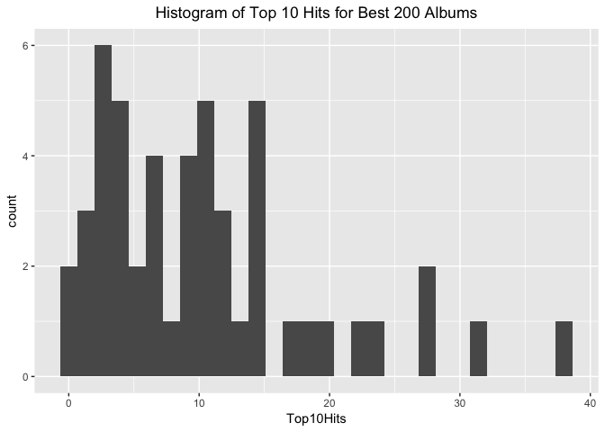

hw10
================
Xinyao Fan
December 5, 2017

Scrape data from the website
----------------------------

I am interested in the 200 greatest women artists, so I try to download the data from the billboard website and then do some data analysis.

``` r
my_url <- "https://www.billboard.com/charts/greatest-billboard-200-women-artists"
page_title <- read_html(my_url)
```

First, I extract the artist name,the rank and also the link for each artist from the website and put all the data into a dataframe.

``` r
get_artist <- function(my_link) {
  my_link %>% 
    read_html() %>% 
    html_nodes(css = ".chart-row__artist") %>% 
    html_text() %>%
    str_trim(side = "both") %>% 
    return()
}

get_rank <- function(my_link) {
  my_link %>% 
    read_html() %>% 
    html_nodes(css = ".chart-row__current-week") %>% 
    html_text() %>% 
    return()
}
Artist <- get_artist(my_url)
rank <- get_rank(my_url)
df <- data_frame(rank = rank,
                 Artist = Artist,
            Link=glue("https://www.billboard.com/music/{Artist}")%>% 
                   str_to_lower() %>% 
                   str_replace_all(" ","-") %>% 
                   str_replace_all("&","") %>% 
                   str_replace_all("'","") %>% 
                   str_replace_all("--","-") %>% 
                   str_replace_all(",","") %>% 
                   str_replace_all("!",""))
```

However, I notice that the artist Mary J. Blige's link is not match the artist name, so I try to replace the link with the correct one.

``` r
df$Link[18] <- "https://www.billboard.com/music/mary-j-blige"
```

Next, I extracted the statistics nested in each artist's page: No1hit,Top10hits,songs and put all this information into a dataframe.

``` r
get_stats <- function(link) {
  link %>% 
    read_html() %>% 
    html_nodes(css = ".artist-section--chart-history__stats__stat--number") %>% 
    html_text() %>% 
    return()
}
```

``` r
get_stats_safe <- purrr::possibly(get_stats, "None available")

df <- df %>% 
  mutate(Stats = map(Link, get_stats_safe))
```

Since some artists don't have data of No1Hit and Top10Hits. So, we have to judge the length of the vector Stats. For the missing information,such as NO1Hit, Top10Hits, we replace the NA by O.

``` r
No1Hits<-c()
Top10Hits<-c()
Songs<-c()

for (i in 1:50) {
    if(length(df$Stats[[i]])==3){
    No1Hits[i]<-df$Stats[[i]][1]
    Top10Hits[i]<-df$Stats[[i]][2]
    Songs[i]<-df$Stats[[i]][3]
    }else if(length(df$Stats[[i]])==2)
  { No1Hits[i]<-0
     Top10Hits[i]<-df$Stats[[i]][1]
    Songs[i]<-df$Stats[[i]][2]
    }else if(length(df$Stats[[i]])==1)
    { 
        No1Hits[i]<-0
        Top10Hits[i]<-0
      Songs[i]<-df$Stats[[i]][1]
    
    }
 
}

df_new<- data_frame(rank = rank,
                 Artist = Artist,
                 Link = glue("https://www.billboard.com/music/{Artist}") %>% 
                   str_to_lower() %>% 
                   str_replace_all(" ","-") %>% 
                   str_replace_all("&","") %>% 
                   str_replace_all("'","") %>% 
                   str_replace_all("--","-") %>% 
                   str_replace_all(",","") %>% 
                   str_replace_all("!",""),
                 No1Hits=as.numeric(No1Hits),
                 Top10Hits=as.numeric(Top10Hits),
                 Songs=as.numeric(Songs))
write_csv(df_new, "women_200.csv")
```

Data Analysis
-------------

``` r
ggplot(df_new, aes(Top10Hits))+geom_histogram()+
  ggtitle("Histogram of Top 10 Hits for Best 200 Albums") +
  theme(plot.title = element_text(hjust = 0.5))
```

    ## `stat_bin()` using `bins = 30`. Pick better value with `binwidth`.



Then, we filter the artists whose No.1 Hits songs&gt;5 and look the detailed information.

``` r
out1<-df_new%>%
    filter(No1Hits>5)%>%
    select(rank,Artist,No1Hits,Top10Hits,Songs)
knitr::kable(out1)
```

| rank | Artist          |  No1Hits|  Top10Hits|  Songs|
|:-----|:----------------|--------:|----------:|------:|
| 3    | Mariah Carey    |       18|         27|     48|
| 4    | Whitney Houston |       11|         23|     39|
| 5    | Madonna         |       12|         38|     57|
| 8    | Janet Jackson   |       10|         27|     40|
| 13   | Rihanna         |       14|         31|     61|
| 17   | The Supremes    |       12|         20|     45|
| 28   | Paula Abdul     |        6|          8|     15|
| 38   | Katy Perry      |        9|         14|     28|
| 40   | Diana Ross      |        6|         12|     40|

``` r
df_new%>% #use fac_order
  filter(No1Hits>5) %>%
  ggplot(aes(y=fct_reorder(Artist, Songs, max,.desc = TRUE),x=Songs)) + geom_point()+scale_y_discrete("artist_name")
```


Now, we want to explore the ratio of Top10 hits songs vs all the singer's songs and arrange them.

``` r
out2<-df_new%>%
    mutate(prob=(-Top10Hits/Songs))%>%
    arrange(prob)%>%
    filter(abs(prob)>0.55)%>%
    select(rank,Artist,Top10Hits,Songs)%>%
    mutate(prob=Top10Hits/Songs)
knitr::kable(out2)
```

| rank | Artist          |  Top10Hits|  Songs|       prob|
|:-----|:----------------|----------:|------:|----------:|
| 41   | Destiny's Child |         10|     14|  0.7142857|
| 8    | Janet Jackson   |         27|     40|  0.6750000|
| 5    | Madonna         |         38|     57|  0.6666667|
| 47   | Evanescence     |          3|      5|  0.6000000|
| 4    | Whitney Houston |         23|     39|  0.5897436|
| 3    | Mariah Carey    |         27|     48|  0.5625000|
| 43   | TLC             |          9|     16|  0.5625000|
